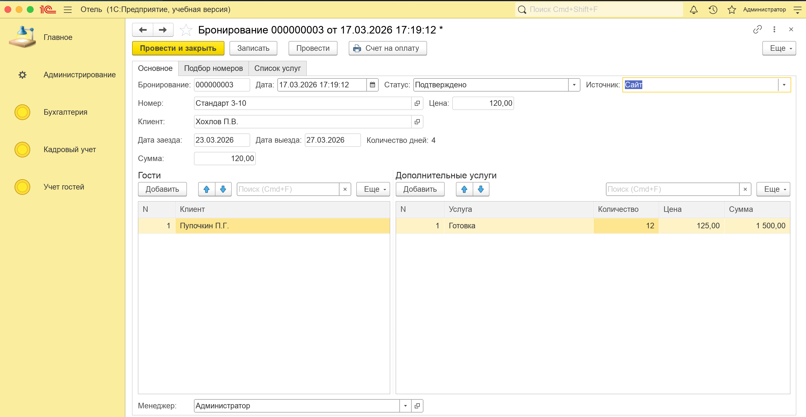
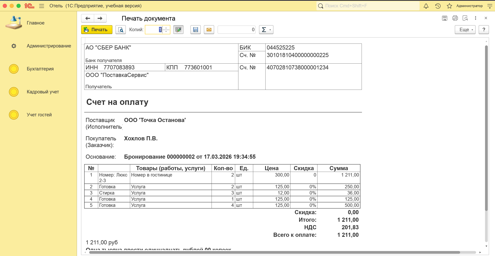
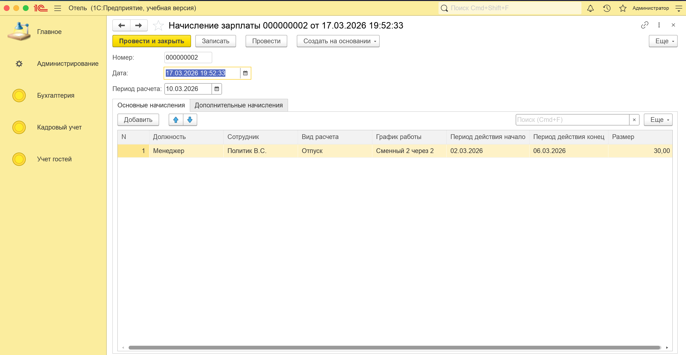
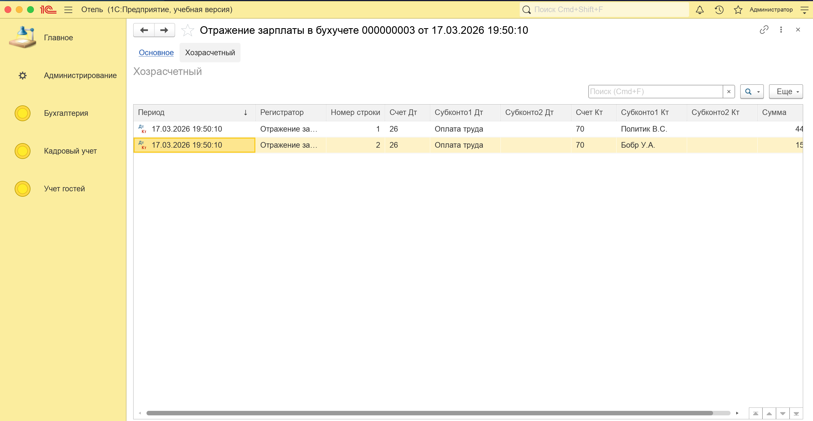

# 🏨 Учетная система отеля «Точка останова»
**Проект автоматизации гостиничного бизнеса на платформе 1С:Предприятие 8.3**

---

## 🎯 Бизнес-цели и требования
Проект разработан для минимизации ошибок ручного учета и оптимизации внутренних процессов отеля. Основные задачи, поставленные заказчиком:

* **Управление бронированием:** Автоматический контроль свободного номерного фонда и исключение ошибок «двойного бронирования».
* **Клиентский сервис:** Централизованное хранение данных гостей и истории их пребывания.
* **Финансовый контроль:** Автоматический расчет стоимости проживания и прозрачный учет взаиморасчетов.
* **HR-блок:** Автоматизация расчета заработной платы сотрудников и отражение затрат в бухгалтерском учете.
* **Аналитика:** Оперативное формирование отчетности по доходам, расходам и задолженностям.

---

## 🛠 Техническая реализация

Проект реализован с использованием ключевых механизмов платформы **«1С:Предприятие»**:

### 1. Бронирование и управление номерным фондом
* **Регистр «БронированиеНомернойФонд»:** Ключевой узел системы, хранящий записи о забронированных датах для каждого номера. При проведении документа «Бронирование» формируются записи в разрезе каждой даты периода.
* **Интеллектуальный подбор:** В документе реализована форма подбора, которая на лету анализирует свободные остатки в регистре. Менеджер видит только доступные номера на выбранные даты с учетом требуемого количества гостей и может сразу выбрать подходящий вариант.
* **Управление услугами:** Реализована страница со списком всех доступных дополнительных услуг отеля. Система позволяет динамически добавлять услуги даже в уже проведенный документ с автоматическим обновлением движений в регистрах.
* **Контроль пересечений:** При попытке занять уже забронированный номер система выдает предупреждение и блокирует транзакцию.

#### Пример бронирования:

---

### 2. Финансовый цикл и взаиморасчеты
* **Регистрация задолженности:** При проведении бронирования формируется движение в регистре накопления **«ВзаиморасчетыСКлиентами»** (тип «Остатки»), фиксируя долг клиента.
* **Учет оплат:** Документ **«Оплата»** позволяет регистрировать поступление денежных средств, закрывая задолженность по конкретному бронированию.
* **Аналитическая отчетность:** Специализированный отчет **«Отчет по задолженностям»** позволяет в реальном времени отслеживать актуальные долги клиентов и суммы переплат (авансов) в разрезе каждого документа-основания.
* **Печать:** Интегрирована подсистема печати **БСП** для формирования счета-заказа.

#### Пример печатной формы счета на оплату:

---

### 3. Расчет зарплаты (HR-модуль)
Реализована полноценная подсистема для автоматизации выплат сотрудникам отеля:
* **Сложные расчеты:** Использованы планы видов расчета и регистры расчета **«ОсновныеНачисления»** и **«ДополнительныеНачисления»**.
* **Виды начислений:** Оклад (по дням), Премия (процентом от базы), а также Больничный лист и Отпуск.
* **Вытеснение:** Настроены правила вытеснения, чтобы периоды болезни или отпуска корректно уменьшали сумму основного начисления (оклада) по периоду действия.
* **Графики:** Учет времени ведется по сменным графикам (сутки через трое, пятидневка), реализованным через регистры сведений.

#### Пример расчета заработной платы:

---

### 4. Бухгалтерский учет и права доступа
* **Хозрасчетный регистр:** Использован план счетов и Регистр бухгалтерии для формирования двойной записи.
* **Отражение в учете:** Создан документ **«Отражение зарплаты в бухучете»**, который вводится на основании начисления. Табличная часть заполняется автоматически, сворачивая все начисления по каждому сотруднику.
* **Проводки:** При проведении формируются проводки вида `Дт 26 (Статья затрат) — Кт 70 (Сотрудник)`. Статьи затрат выбираются из соответствующего справочника и подставляются в субконто.

#### Пример формирования бухгалтерских проводок:

---

* **Безопасность:** Разграничены права доступа для ролей **Менеджер** (операционная работа, подбор номеров) и **Бухгалтер** (финансы, оплаты и зарплата).

---

## 📂 Структура репозитория
* `/src` — исходный код конфигурации (выгрузка в файлы XML для удобного просмотра кода).
* `/img` — скриншоты интерфейса и печатных форм.
* `HotelProject.dt` — выгрузка информационной базы для быстрой загрузки и тестирования.

---

## 🚀 Как запустить проект
1. Создайте пустую информационную базу в платформе **1С 8.3**.
2. Зайдите в Конфигуратор.
3. Выполните: `Администрирование` -> `Загрузить информационную базу` и выберите файл `HotelProject.dt`.
4. Для входа используйте пользователей: **Администратор**, **Менеджер** или **Бухгалтер** (пароли отсутствуют).

---
**Разработчик:** Хохлов Алексей ([@Alexkhokhlow](https://github.com/Alexkhokhlow))
